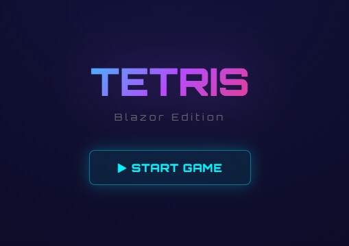
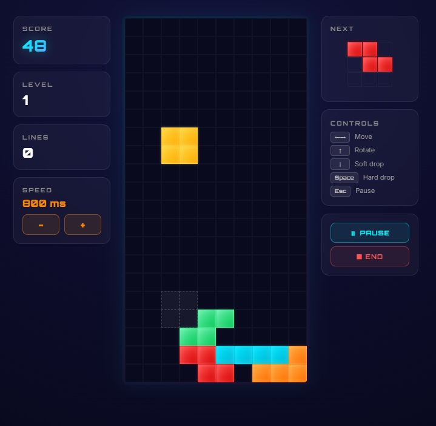
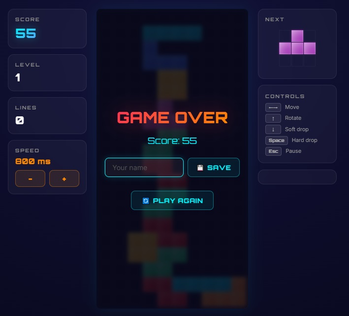

[Live demo — http://tetr.runasp.net](http://tetr.runasp.net)

# Blazor Tetris

A Tetris-style game built with Blazor and .NET 9. This repository contains a single-page web application implemented with Blazor components demonstrating interactive UI, game logic, and component-driven design.



## Highlights

- Built with `Blazor` and `.NET 9` (`BlazorApp.csproj`).
- Component-based architecture: reusable game field, cell components and figure builders.
- Smooth game loop and state updates using timers and component re-rendering.
- Simple, clear UI demonstrating front-end interaction with C#.

## Features

- Playable Tetris-like game with falling figures, collision detection and line handling.
- Start / Play / End screens with clear visual states.
- Configurable field size and game speed.
- Easily extendable piece set and game rules.



## Screenshots

- Start screen: `Start.jpg`
- Gameplay: `Play.jpg`
- End / Game Over: `end.jpg`



## How to run

Prerequisites:

- .NET 9 SDK installed (download from the official Microsoft site).

From the repository root:

1. Restore and build:

```
dotnet restore
dotnet build
```

2. Run the app:

```
dotnet run --project BlazorApp.csproj
```

3. Open a browser and navigate to the URL printed in the console (usually `https://localhost:5001` or `http://localhost:5000`).

Alternatively, open the solution in Visual Studio (2022/2024 with .NET 9 support) and run the project.

## Project structure (important files)

- `BlazorApp.csproj` — project file targeting `net9.0`.
- `Pages/Index.razor` and `Pages/Index.razor.cs` — main page and backing logic.
- `Components/GameField.razor` and `Components/GameField.razor.cs` — game field rendering and game logic.

## Notes / talking points

- Explain component lifecycle and how the game uses `StateHasChanged()` to update UI.
- Discuss timer usage for the game loop and the trade-offs between `System.Timers.Timer` and `System.Threading.Timer`.
- Point out how game state (current and next figure, static field) is represented and how collision detection is implemented.
- Mention opportunities for improvement (sound effects, scoring, persistent high scores, mobile/touch controls).

## Contributing

Contributions are welcome. Open an issue or submit a pull request with descriptive details.

## License

Include an appropriate license file if you want this project to be open source. If none is provided, the default is that the repository is not licensed for reuse.

---

This README describes the project, its features, and how to run it. Replace or extend screenshots and the notes section as needed to tailor the presentation.
